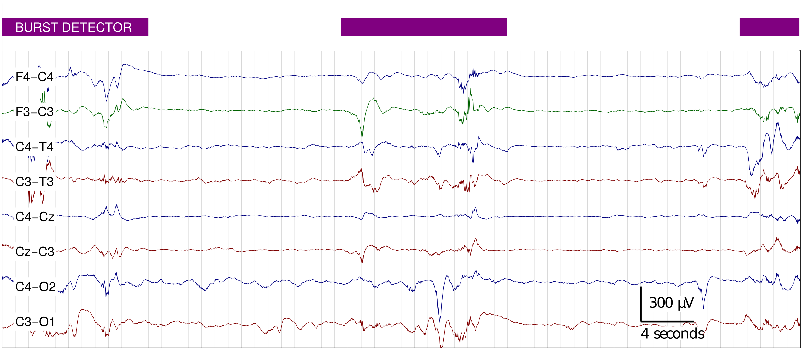
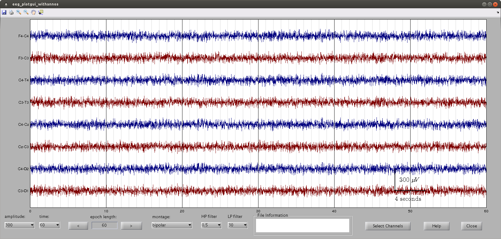

EEG viewer for Matlab
=====================

Plotting function for EEG signals that implements shortcut keys for scrolling.  Limited
options also available.  Very much in development phase so entirely possibly will not work
or break.

If shortcuts not working then bring plot axis into focus by clicking on main plot axis.

Requires Matlab programming environment.

 ((taken
 from EEG burst detector))[http://otoolej.github.io/code/burst_detector/]


# contents
* [example](#example)
* [options and keys](#options)
* [requirements](#requirements)
* [test computer setup](#test-computer-setup)
* [licence](#licence)
* [contact](#contact)


# example
```matlab
        %---------------------------------------------------------------------
		% test signal
		%---------------------------------------------------------------------
		Fs = 64;                     % sampling rate
		mins = 60*Fs;
		x = rand(9,3*mins).*rand(9,3*mins).*(100);         % 9-channels of 10 minute data
		channel_labels = {'F3','F4','C3','C4','Cz','T3','T4','O1','O2'};

        %---------------------------------------------------------------------
		% bring up plot figure
		%---------------------------------------------------------------------
		eeg_plotgui_withannos('signals',x, ...
		'fs',Fs, ...
		'channel_labels',channel_labels, ...
		'epoch_length',mins./60, ...
		'insert_ta_scale',1 ...
		);

        %---------------------------------------------------------------------
		% use left/right arrows to scroll and up/down arrows to change 
		% amplitude scale
		%---------------------------------------------------------------------
```



# options

Call function with:

| input arguments    | default value(if any) | comment                                   |
|--------------------+-----------------------+-------------------------------------------|
| signals            |                       | matrix of EEG signals                     |
| fs                 |                       | sampling frequency (Hz)                   |
| annotations        |                       | 1 or 2 annotations to plot above          |
| channel_labels     |                       | channel labels of 'signals'               |
| amplitude_scale    |                   300 | amplitude scaling                         |
| hard_limit_voltage |                       | if want upper limit on voltage            |
| highlight_channel  |                       | highlight channel(s) in green             |
| bipolar_montage    |                     1 | if want to start with bipolar montage     |
| message_string     |                       | working?                                  |
| full_screen        |                     0 | working?                                  |
| lpf_cutoff         |                     0 | low-pass filter cut-off                   |
| hpf_cutoff         |                     0 | high-pass filter cut-off                  |
| annotation_labels  |                       | labels to 1/2 annotations                 |
| epoch_length       |                       | how long to plot (seconds)                |
| mask               |                       | ?                                         |
| insert_ta_scale    |                     0 | include time-amplitude scale legend (0/1) |
| ta_xlength         |                     4 | length of time legend (seconds)           |
| time_range         |                       | start and stop times for plot (seconds)   |


Shortcut keys:

 | key         | function                                           |
 |-------------+----------------------------------------------------|
 | up-arrow    | increase amplitude scale (+10%)                    |
 | down-arrow  | decrease amplitude scale (-10%)                    |
 | m           | toggle montage (between mono-polar and bipolar)    |
 | left-arrow  | scroll forward (by 0.1 of epoch length) time scale |
 | right-arrow | scroll back (by 0.1 of epoch length) time scale    |
 | page-up     | scroll forward (+80%)                              |
 | page-down   | scroll back (-80%)                                 |
 | a           | increase time scale                                |
 | s           | decrease time scale                                |
 | i           | insert time mark: annotate data (click to remove)  |
 | d           | display the start/stop times of the annotations    |
 | c           | annotate channel                                   |
 | v           | measure voltage (amplitude) with cross-hairs       |
 | x           | insert time-amplitude label in fixed location      |


# requirements
Either Matlab (R2013 or newer,
[Mathworks website](http://www.mathworks.co.uk/products/matlab/)).


# test computer setup
- hardware:  Intel(R) Xeon(R) CPU E5-1603 0 @ 2.80GHz; 8GB memory.
- operating system: Ubuntu GNU/Linux x86_64 distribution (Vivid Vervet, 15.04), with Linux
  kernel 3.19.0-31-generic 
- software: Octave 3.8.2 (using Gnuplot 4.6 patchlevel 6), with 'octave-signal' toolbox, and Matlab (R2013a)

---

# licence

```
Copyright (c) 2015, John M. O' Toole, University College Cork
All rights reserved.

Redistribution and use in source and binary forms, with or without modification,
are permitted provided that the following conditions are met:

  Redistributions of source code must retain the above copyright notice, this
  list of conditions and the following disclaimer.

  Redistributions in binary form must reproduce the above copyright notice, this
  list of conditions and the following disclaimer in the documentation and/or
  other materials provided with the distribution.

  Neither the name of the University College Cork nor the names of its
  contributors may be used to endorse or promote products derived from
  this software without specific prior written permission.

THIS SOFTWARE IS PROVIDED BY THE COPYRIGHT HOLDERS AND CONTRIBUTORS "AS IS" AND
ANY EXPRESS OR IMPLIED WARRANTIES, INCLUDING, BUT NOT LIMITED TO, THE IMPLIED
WARRANTIES OF MERCHANTABILITY AND FITNESS FOR A PARTICULAR PURPOSE ARE
DISCLAIMED. IN NO EVENT SHALL THE COPYRIGHT HOLDER OR CONTRIBUTORS BE LIABLE FOR
ANY DIRECT, INDIRECT, INCIDENTAL, SPECIAL, EXEMPLARY, OR CONSEQUENTIAL DAMAGES
(INCLUDING, BUT NOT LIMITED TO, PROCUREMENT OF SUBSTITUTE GOODS OR SERVICES;
LOSS OF USE, DATA, OR PROFITS; OR BUSINESS INTERRUPTION) HOWEVER CAUSED AND ON
ANY THEORY OF LIABILITY, WHETHER IN CONTRACT, STRICT LIABILITY, OR TORT
(INCLUDING NEGLIGENCE OR OTHERWISE) ARISING IN ANY WAY OUT OF THE USE OF THIS
SOFTWARE, EVEN IF ADVISED OF THE POSSIBILITY OF SUCH DAMAGE.
```


---

# contact

John M. O' Toole

Neonatal Brain Research Group,  
Irish Centre for Fetal and Neonatal Translational Research (INFANT),  
Department of Paediatrics and Child Health,  
University College Dublin,  
Western Gateway Building, Room 2.17,  
Cork, Ireland


